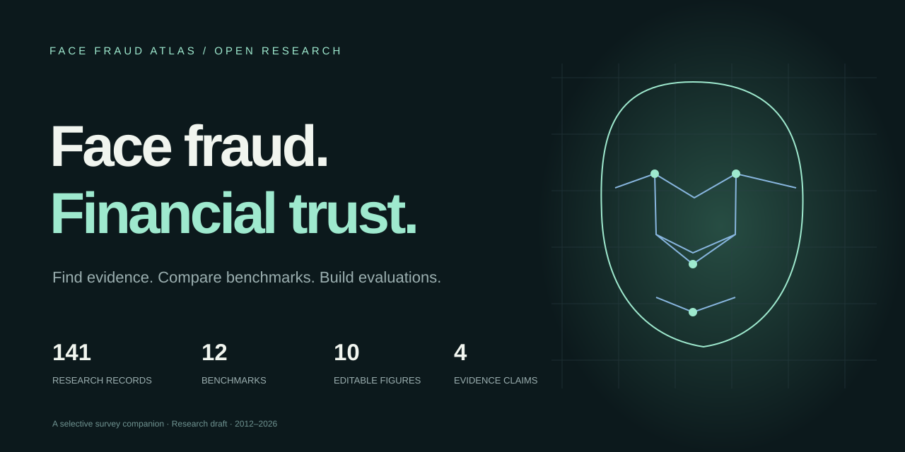

<p align="center">
  
</p>

# Face Fraud Atlas · 人脸欺诈研究图谱

**连接人脸欺诈检测证据与数字金融身份核验流程的交互式研究配套项目。**

[English](README.md) · [数据结构](docs/DATA_SCHEMA.md) · [贡献说明](CONTRIBUTING.md) · [项目设计](docs/PROJECT_DESIGN.zh-CN.md) · [部署说明](docs/DEPLOYMENT.zh-CN.md)

本项目将人脸呈现攻击检测、数字操纵检测、身份变形、识别规避和媒体注入放在同一个金融核验流程中理解。读者可以从“方法观察到了什么”出发，进一步检查“这些观察支持什么判断”，以及“授予账户或交易权限之前还缺什么证据”。

研究框架围绕四项要求组织：**媒体真实性、身份一致性、采集与会话来源、有效业务授权**。它们分别对应媒体、身份、事件来源和被允许的业务操作，不能由一个分类分数统一替代。

> **项目状态：**本仓库配套的是匿名研究论文草稿，不表示论文已被 CSUR 接收、发表或通过同行评审。预定部署地址为 **https://xukun12138.github.io/face-fraud-atlas/**，当前部署状态待核验。静态项目可在本地预览。

## 可以怎样使用

| 功能 | 可完成的工作 | 解释边界 |
| --- | --- | --- |
| **文献探索器** | 搜索、按主题/年份/发表形态筛选、查看来源、导出阅读清单 | 书目核验不代表统一深度全文阅读；官方资源与研究论文分开计数 |
| **基准数据集图谱** | 查看规模、模态、版本、协议与来源 | 保留图像、视频、人脸序列、通道流等原单位，不跨单位求和或做规模排名 |
| **风险分析实验室** | 改变攻击基率、召回率、误告警率与会话数，查看预期告警组成 | 结果来自透明公式与设定场景，不执行人脸模型推理，不是部署性能测量 |
| **评测协议构建器** | 选择业务流程、攻击入口及隔离因素，导出 JSON 研究计划 | 包含阈值、分组和事件要求，具体权限与指标分母仍须按实验补充；不代表已完成评测或认证 |
| **图表与来源** | 查看十幅图的说明、原始统计及可编辑材料 | 数据来源统计、解析曲线、示意图分别解释，避免把示意当作实验结果 |
| **研究材料下载** | 阅读完整草稿，检查 LaTeX、书目和图表数据 | 使用方式同时受论文、数据及第三方素材各自权利约束 |

## 当前整理范围

初始版本包含 **141 篇研究文献与 12 项官方资源，共 153 条目录记录**，另外提供 **12 个基准记录与 10 幅可编辑研究图**。这些数字属于不同集合，不能把基准和图表再次加到论文数上。后续维护应从源数据重新生成统计。

文献库属于选择性、来源可追溯的整理，不是穷尽数据库检索、引文排名或统一深度的全文系统评价。金融相关性区分原论文直接支持的系统证据、远程身份核验研究，以及从通用生物识别或媒体检测条件向金融场景作出的分析性迁移。数据集规模并不直接反映金融威胁的真实难度。

建议按下面的顺序阅读：先选择需要保护的判断，再筛选检测任务和证据类型；随后核对传感器、参考样本、预训练和目标域数据等前提；检查基准单位与版本；最后用风险分析和协议 JSON 明确评测的正类、阈值、重试与最终业务结果。

## 本地预览

项目使用静态 HTML、CSS、JavaScript 和 JSON，无需安装 npm 依赖或下载模型。安装 Python 3 后，在仓库根目录运行：

```sh
python scripts/build_catalog.py
python scripts/validate_site.py
python -m http.server 8765 --directory site
```

在浏览器打开 **http://localhost:8765/**。浏览器需要通过 HTTP 读取 JSON，因此不要直接双击 HTML 文件。界面按桌面和手机屏幕设计；正式部署验收仍须检查不同宽度、键盘操作和下载链接。

## 下载材料

| 文件 | 路径 |
| --- | --- |
| 匿名完整论文 PDF | [site/downloads/manuscript.pdf](site/downloads/manuscript.pdf) |
| 主 LaTeX 源码 | [site/downloads/manuscript.tex](site/downloads/manuscript.tex) |
| BibTeX 书目 | [site/downloads/sample-base.bib](site/downloads/sample-base.bib) |
| 完整 LaTeX 项目 | [site/downloads/latex-project.zip](site/downloads/latex-project.zip) |
| 图表数据、可编辑源与核验记录 | [site/downloads/Figure_Data.zip](site/downloads/Figure_Data.zip) |
| 文献目录 CSV | [site/downloads/paper-catalog.csv](site/downloads/paper-catalog.csv) |
| 基准目录 CSV | [site/downloads/benchmark-catalog.csv](site/downloads/benchmark-catalog.csv) |

论文排版中的书目不包含 DOI 和 URL 字段；可追溯链接另保留于目录和核验材料。项目提供数据集说明及原始来源入口，不重新分发人脸生物特征数据集。

## 维护与贡献

源数据位于 `data/catalog-records.csv`、`data/benchmark-sources.csv`；书目位于 `paper-source/`；可编辑图表材料位于 `Figure_Data/`。`scripts/build_catalog.py` 将输入转换为 `site/data/` 中的浏览器 JSON，并自动同步两个公开目录 CSV；随后运行 `python scripts/validate_site.py` 核对资源和记录。图与下载清单、研究压缩包在受影响时另行更新。公开预览和下载文件在 `site/` 中，与项目文档、开发输入分开保存。

欢迎补充文献、修正书目、核对基准版本或提出解释上的改进。请保留记录 ID，提供原论文、正式出版页或数据集作者的来源；未知字段留空，不根据占比或经验补造整数。贡献流程见 [CONTRIBUTING.md](CONTRIBUTING.md)，字段约定见 [DATA_SCHEMA.md](docs/DATA_SCHEMA.md)。

## 署名与权利

仓库维护者为 **[xukun12138](https://github.com/xukun12138)**。维护者身份不代表匿名论文作者信息。

[MIT 许可证](LICENSE) 仅覆盖本项目代码。论文文本、资料汇编、研究图和第三方材料的权利分别处理；不因代码使用 MIT 就自动获得这些材料的再利用权，也不在此为论文或目录指定整体 CC-BY 许可。第三方素材保留其原许可证与署名，数据集或出版物的再利用条件应向原权利人核实。

使用具体方法或数据集时，应引用原论文。引用这个持续变化的目录时，请记录仓库版本或提交及访问日期，不把匿名草稿描述为已发表的 CSUR 论文。

## 设计参考

组织方式参考了 [DeepfakeBench](https://github.com/SCLBD/DeepfakeBench) 的实验条件说明、[DeepFAS](https://github.com/ZitongYu/DeepFAS) 的模态和学习范式分类、[深度伪造生成与检测综述目录](https://github.com/flyingby/Awesome-Deepfake-Generation-and-Detection) 的操作分类，以及 [Nerfies](https://nerfies.github.io/)、[SMERF](https://smerf-3d.github.io/) 的研究材料导航。这些项目与本项目相互独立，没有复制其代码或图像。
